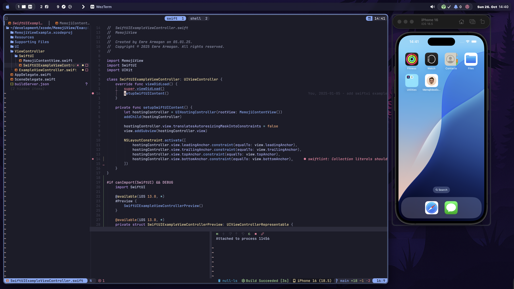

# Emre`s dotfiles

> **⚠️ Caution**  
>  Before using these dotfiles, you should **fork this repository**, review the code, and remove anything you **don’t want or need**.  
⚠ **Use at your own risk!**


&nbsp;

## Installation

### Ansible Setup (Recommended)

This repository includes an Ansible playbook for automated setup. **This is the recommended way to install and manage your dotfiles.**


#### Running the Playbook

To apply the dotfiles to your system:

```bash
ansible-playbook ansible/playbook.yml --ask-become-pass
```

#### Testing with `ansible/test.sh`

The script `ansible/test.sh` allows you to test your Ansible playbook within a Docker container. This is useful for verifying your playbook works as expected before running it on your actual system.

---

### Install Script (Deprecated)
#### **1. Clone the Repository**
```sh
git clone https://github.com/emrearmagan/dotfiles.git ~/.dotfiles
cd ~/.dotfiles
```

### **2. Run the Setup Script**
```sh
sh setup.sh
```
This script will:
- Create **symlinks** for configuration files in your home directory.
- Set up **iTerm2 preferences** (if installed).
- Install **Homebrew packages** from the `Brewfile`.

You will also want a [Nerd Font](https://www.nerdfonts.com/).

---


## **Folder Structure**
```
dotfiles/
│── bat/          # Configuration for bat (better cat)
│── git/          # Git config and global ignore
│── homebrew/     # Homebrew setup and Brewfile
│── iterm/        # iTerm2 preferences
│── neovim/       # Neovim configuration
│── system/       # System-wide aliases and functions
│── tmux/         # Tmux configuration
│── zsh/          # Zsh config files (.zshrc, .zprofile)
│── setup.sh      # Setup script to symlink files and install dependencies
```

---

## **License**
MIT License – Use freely, but **at your own risk**.
