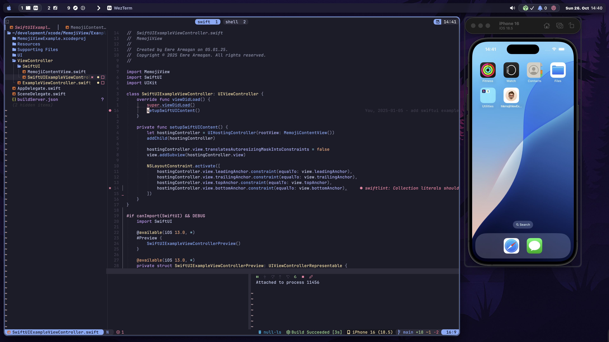

# Emre`s dotfiles

> **⚠️ Caution**  
>  Before using these dotfiles, you should **fork this repository**, review the code, and remove anything you **don’t want or need**.  
⚠ **Use at your own risk!**



## Setup

For macOS. Install [Homebrew](https://brew.sh) first if you want packages or fonts.

```sh
git clone https://github.com/emrearmagan/dotfiles.git ~/.dotfiles
cd ~/.dotfiles

./setup               # Show usage and tags
./setup --tag dotfiles
./setup --tag brew
./setup --tag fonts
./setup --tag xcode    # Optional Xcode development tools
```

`brew` uses [`homebrew/Brewfile`](homebrew/Brewfile). `xcode` installs Neovim’s Xcode tools; install and select Xcode separately.

Existing files are backed up in `~/.dotfiles_backup/`. Correct links are skipped.

## Adding things

Add a config in [`setup.d/dotfiles.sh`](setup.d/dotfiles.sh):

```sh
link "config/example" ".config/example"
```

Paths are relative to the checkout and your home. For a new tag, add `setup.d/example.sh`, then run `./setup --tag example`.

## License

MIT License – Use freely, but **at your own risk**.
